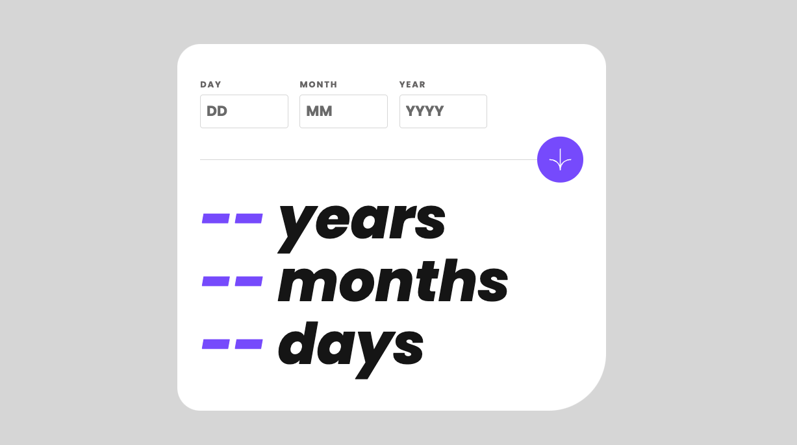
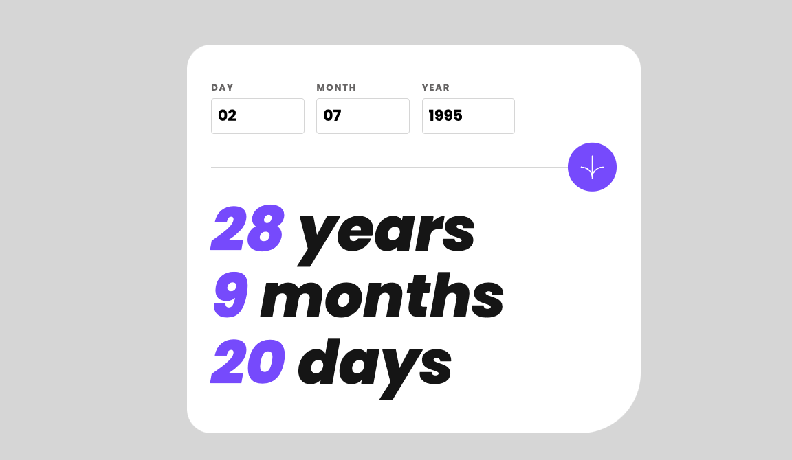

# Frontend Mentor - Age calculator app solution

This is a solution to the [Age calculator app challenge on Frontend Mentor](https://www.frontendmentor.io/challenges/age-calculator-app-dF9DFFpj-Q). Frontend Mentor challenges help you improve your coding skills by building realistic projects.

## Table of contents

- [Overview](#overview)
  - [The challenge](#the-challenge)
  - [Screenshot](#screenshot)
  - [Links](#links)
- [My process](#my-process)
  - [Built with](#built-with)
  - [What I learned](#what-i-learned)
- [Author](#author)
<!-- - [Acknowledgments](#acknowledgments) -->

**Note: Delete this note and update the table of contents based on what sections you keep.**

## Overview

### The challenge

Users should be able to:

- View an age in years, months, and days after submitting a valid date through the form
- Receive validation errors if:
  - Any field is empty when the form is submitted
  - The day number is not between 1-31
  - The month number is not between 1-12
  - The year is in the future
  - The date is invalid e.g. 31/04/1991 (there are 30 days in April)
- View the optimal layout for the interface depending on their device's screen size
- See hover and focus states for all interactive elements on the page
- **Bonus**: See the age numbers animate to their final number when the form is submitted

### Screenshot




### Links

- Solution URL: [My solution](https://www.frontendmentor.io/solutions/age-calculator-vanilla-js-deploy-github-pages-w-vite-IYtERzOrzV)

- Live Site URL: [Age calculator app](https://vicschbt.github.io/PERSO-age-calculator-app/)

## My process

1. I structured my HTML file using **BEM naming** convention for the css classes
2. I styled my app using a **mobile-first** approach
3. I created the calculating functions
4. I added the error handling part
5. I did the bonus animation on the result display

### Built with

- Semantic HTML5 markup
- Sass -> SCSS
- Flexbox
- Mobile-first workflow
- Vanilla JS

### What I learned

This challenge was a very good opportunities to review the basics of Date in JS. Also, I did some stuff with the `setInterval` function to create the animation on the result.

```js
let day = 0,
  month = 0,
  year = 0;
let resultAnimation;

const animateResults = (dayResult, monthResult, yearResult) => {
  if (day <= dayResult) {
    results[2].innerHTML = day;
    day++;
  }
  if (month <= monthResult) {
    results[1].innerHTML = month;
    month++;
  }
  if (year <= yearResult) {
    results[0].innerHTML = year;
    year++;
  }

  if (day === dayResult && month === monthResult && year === yearResult) {
    console.log("animation stops");
    clearInterval(resultAnimation);
  }
};
```

If you want more help with writing markdown, we'd recommend checking out [The Markdown Guide](https://www.markdownguide.org/) to learn more.

**Note: Delete this note and the content within this section and replace with your own learnings.**

## Author

<!-- - Website - [Add your name here](https://www.your-site.com) -->

- Frontend Mentor - [@VicSchbt](https://www.frontendmentor.io/profile/VicSchbt)
- LinkedIn - [Victoire Schubert](www.linkedin.com/in/victoire-schubert)
- Instagram - [@vicschbt.codes](https://www.instagram.com/vicschbt.codes?igsh=OHczMzcwMWpjZm1p&utm_source=qr)

<!-- ## Acknowledgments

This is where you can give a hat tip to anyone who helped you out on this project. Perhaps you worked in a team or got some inspiration from someone else's solution. This is the perfect place to give them some credit.

**Note: Delete this note and edit this section's content as necessary. If you completed this challenge by yourself, feel free to delete this section entirely.** -->
